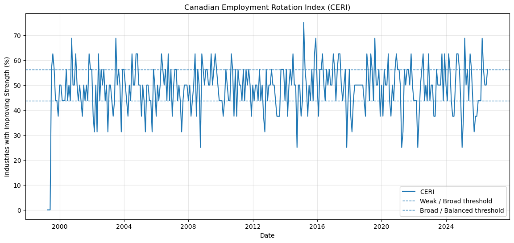
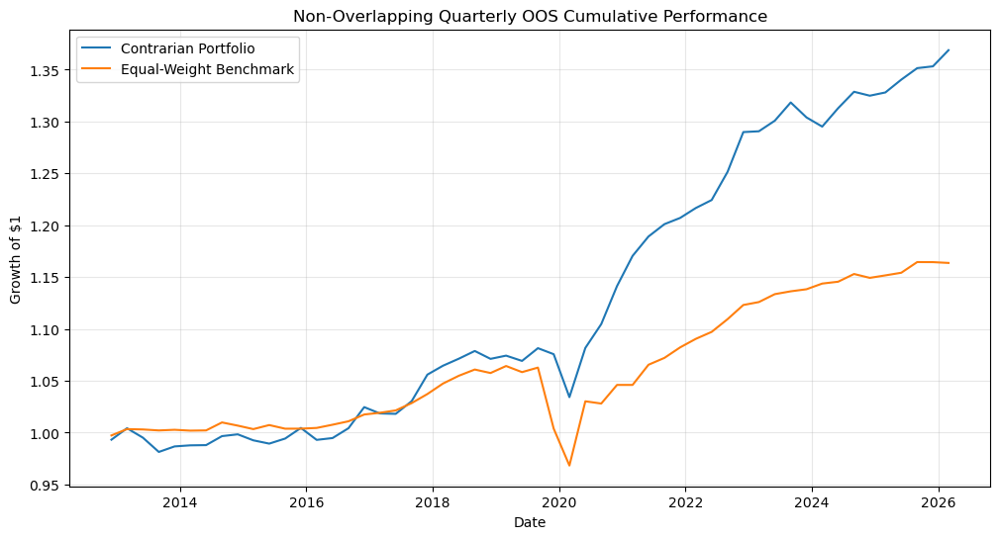
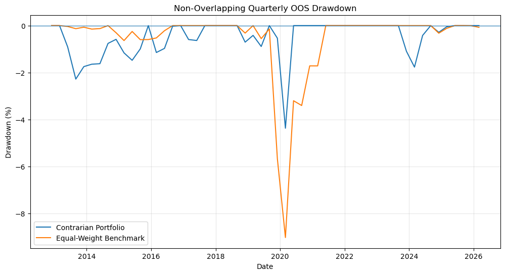

# Canadian Industry Rotation

## Building an Employment-Based Portfolio Strategy

### Research Question

Can employment dynamics help identify which Canadian industries are becoming stronger or weaker before the change becomes obvious?

### Overview

This project develops an employment-based framework for identifying Canadian industry strength, economic rotation, and potential portfolio allocation signals using monthly Statistics Canada data from 1987 to 2026.

### What I Built

- Industry Strength Score (CISS)
- Canadian Employment Rotation Index (CERI)
- Industry rotation framework
- Employment-based contrarian portfolio strategy
- Out-of-sample validation
- Transaction-cost sensitivity analysis
- Drawdown and robustness testing

### Key Results

| Metric | Result |
|---|---:|
| Gross OOS excess growth | +0.3015% per quarter |
| Gross OOS p-value | 0.0502 |
| OOS cumulative growth | 36.88% vs 16.36% |
| OOS maximum drawdown | -4.37% vs -9.02% |
| Net excess @ 0.25% cost | +0.0121% per quarter |
| Net OOS p-value @ 0.25% cost | 0.9373 |

### Conclusion

The employment-based contrarian strategy produced promising gross out-of-sample results, with higher cumulative employment growth and lower maximum drawdown than the benchmark.

However, the gross advantage was only borderline statistically significant. After applying a 0.25% one-way transaction-cost assumption, the remaining excess performance became economically negligible and statistically insignificant.

### Important Limitation

This study uses employment data rather than stock-price data.

Therefore, the portfolio analysis represents simulated **employment-growth outcomes**, not realized stock-market returns or investment performance.

### Data Source

Statistics Canada monthly industry employment data.

### Project

This repository contains the research output and supporting analysis for the Canadian Industry Rotation project.

## Key Visuals

### 1. Canadian Employment Rotation Index (CERI)

### 2. Non-Overlapping Quarterly OOS Cumulative Performance

### 3. Non-Overlapping Quarterly OOS Drawdown

